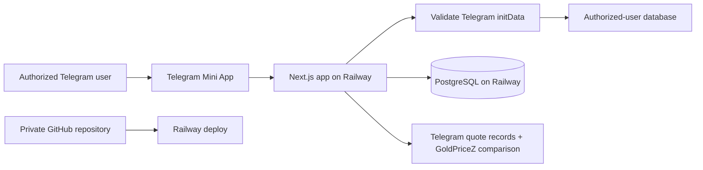

# TG Trading — GitHub, Railway, and Authorized-User Access

## Deployment model

TG Trading will be a private **Telegram Mini App** backed by a web application:

The Railway URL must be publicly reachable for Telegram to load the Mini App,
but **no business data or actions are public**. Every protected page and API
request is authorized on the server.

## Identity and authorization flow

1. The Mini App sends `Telegram.WebApp.initData` to the backend over HTTPS.
2. The backend validates Telegram’s HMAC signature and verifies that `auth_date`
   is recent. Never trust `initDataUnsafe` or client-provided Telegram user data.
3. The backend reads the validated Telegram user ID and checks it against the
   server-side authorized-user table.
4. If authorized and active, the backend creates a short-lived, secure session.
   If not, return an `Access not approved` screen with no application data.
5. Every server action, API route, and database query additionally checks the
   session identity and role. UI hiding alone is never authorization.

Telegram requires `initData` to be validated on the server and warns that the
client-exposed `initDataUnsafe` must not be trusted. [Telegram Mini Apps
documentation](https://core.telegram.org/bots/webapps)

## Authorization model

| Role | Access |
| --- | --- |
| Owner | Full access; approve/revoke users; configure providers and rules |
| Trader | Only their own trade plans, quotes, evidence, dashboard, and reports |
| Viewer (optional later) | Read-only access to explicitly granted records |
| Unapproved | No data or actions; access-denied screen only |

### Authorized-user record

- Random internal user ID (do not expose sequential database IDs)
- Telegram numeric user ID, stored as a 64-bit-safe value/string
- Role and status: `pending`, `active`, `suspended`, or `revoked`
- Approved/revoked timestamps and the owner who performed the action
- Last validated Telegram login and audit events

Do not authorize users by Telegram username: usernames can change. Use the
validated numeric Telegram user ID, then display a username only as a label.

## Security baseline

- Keep the GitHub repository private; enable branch protection and require review
  once other developers contribute.
- Put the bot token, database URL, session-signing secret, and any approved
  external-feed credentials only in Railway environment variables. Never commit
  them or expose them through `NEXT_PUBLIC_*` variables.
- Use production builds (`next build` / `next start`), TLS, secure/HttpOnly/
  SameSite session cookies in production, CSRF protection for state-changing
  cookie-authenticated requests, and short session expiry.
- Put server-only database, Telegram-validation, and secret modules behind
  server-only imports. The browser gets only public configuration.
- Apply authorization checks in every route/action and filter every query by
  the authenticated user’s ownership/role.
- Rate-limit login/validation, quote ingestion, uploads, and all state-changing
  endpoints; validate all input at runtime.
- Store provider/Telegram messages as text or metadata only; never render them
  as raw HTML. Encrypt data at rest where supported and keep an immutable audit
  log for approvals, quotes, trade state changes, and overrides.
- Back up PostgreSQL, test restoration, and restrict Railway/GitHub account
  access with MFA.

## Railway environments

| Environment | Purpose | Access |
| --- | --- | --- |
| Local | Development using test bot/data | Developer machine only |
| Staging | Test Telegram Mini App and database migrations | Owner and approved testers only |
| Production | Private live mini app | Authorized Telegram users only |

Use distinct bot/database/secrets for staging and production. Never test with
production user data or reuse a production session secret.

Railway can deploy a service from a GitHub repository and keeps deployment
variables in the service configuration. [Railway services](https://docs.railway.com/services)
and [Railway variables](https://docs.railway.com/integrations/api/manage-variables)

## GitHub → Railway delivery sequence

1. Create a **private** GitHub repository for `tgtrading`.
2. Add `.gitignore`, a safe `.env.example` containing names only, and dependency
   lockfile; confirm no secrets are staged.
3. Push the protected `main` branch; later use feature branches and pull requests.
4. Create Railway project with PostgreSQL and a web service connected to the
   GitHub repository.
5. Set production secrets in Railway’s Variables panel, not source control.
6. Deploy staging first; configure the Telegram Mini App URL for staging and
   validate allowlist rejection/approval behavior.
7. Set the production Mini App URL only after successful security and recovery
   checks. Railway supports GitHub-connected services and environment variables;
   a generated/custom domain is configured from the service networking settings.
   [Railway deployment guide](https://docs.railway.com/quick-start)

## Launch acceptance tests

- An unapproved Telegram account cannot view any screen, API response, trade,
  provider, or quote.
- Changing a Telegram username does not change access; revoking the numeric ID
  immediately blocks the next authenticated request.
- A forged/expired `initData` payload is rejected by the backend.
- One trader cannot request another trader’s trade or provider record by editing
  a URL or API identifier.
- All secrets remain absent from the browser bundle, logs, repository, and error
  messages.
- Database backup restoration works in staging.
