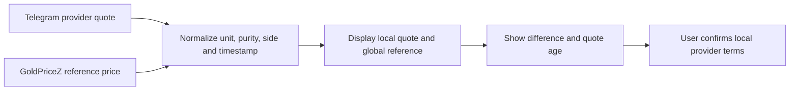

# TG Trading — GoldPriceZ Comparison Feed

## Purpose

GoldPriceZ is an external **reference feed** used to compare global gold pricing
with local provider quotes obtained from Telegram groups. It is not the local
provider’s binding quote, and it must not automatically settle a local trade.

The GoldPriceZ site publishes gold prices across weights/purities and displays
prices, bid/ask values, and timestamps. See [GoldPriceZ’s USD gold
page](https://goldpricez.com/). Before automated use, confirm its permitted
access method, data licence, update frequency, attribution requirements, and
rate limits with GoldPriceZ; do not build production scraping around a page
intended only for normal browser use.

## Data-source hierarchy

| Source | Role | Can create a trade? | Can settle a local trade? |
| --- | --- | --- | --- |
| Verified Telegram provider quote | Local deal quote | Yes, after direct provider confirmation | Yes, after documented provider close confirmation |
| GoldPriceZ reference | Global price comparison | No | No |
| Unverified Telegram message | Market context | No | No |

## Comparison logic

For every local provider quote, show the matching GoldPriceZ reference next to
it only after the product, purity, currency, and weight conversion are confirmed.

### Calculation

`local premium/discount = normalized local provider price − normalized GoldPriceZ reference price`

The app displays both the currency amount and percentage difference. It labels
the comparison **indicative** because local product purity, physical delivery,
provider spread, time delay, and exchange rate may explain the difference.

Never call a difference “profit” or “arbitrage” until all local deal costs and
actual settlement conditions have been confirmed.

## Required normalized fields

- Source name, URL/identifier, retrieval time, and source-published timestamp
- Price value and currency
- Gold purity/grade and product description
- Weight unit and explicit conversion rule to the local tael used by the provider
- Price side: bid, ask, spot/mid, or unspecified
- Calculated USD and local-tael equivalents, with the calculation version
- Data status: current, delayed, unavailable, or conversion-not-comparable

If any required field is unknown, show both prices but disable the difference
calculation and explain why.

## Dashboard UI

For the selected local-gold product:

| Item | Display |
| --- | --- |
| Local provider | Provider name, buy/sell quote, tael unit, Telegram timestamp, status |
| GoldPriceZ reference | Price, unit/purity, published timestamp, retrieval timestamp, status |
| Difference | Amount and percentage, marked `indicative comparison` |
| Decision state | `No local deal`, `Draft`, `Confirmed with provider`, `Active`, or `Closed` |

Use a stale-data warning when either source is older than the configured limit.
Do not compare a 24K physical-gold quote with an XAU/USD or different-purity
reference as if they were identical; require a documented conversion.

## Implementation phases

1. **Manual reference capture:** paste or enter a GoldPriceZ value, source time,
   and product/unit alongside a Telegram provider quote.
2. **Supported feed adapter:** add scheduled retrieval only after permission/
   licence and a stable, supported access method are confirmed.
3. **Comparison history:** retain source snapshots to review local premiums and
   provider consistency over time.

## Guardrails

- Preserve the exact reference snapshot used for a decision; never rewrite past
  comparisons with later prices.
- Surface source outage or stale data instead of using a cached value silently.
- A comparison feed informs your decision only. The confirmed local provider
  quote controls the active trade record and close-out calculation.
