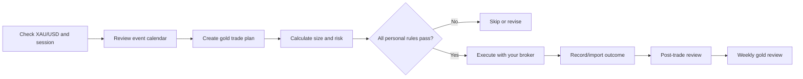

# TG Trading — Gold-First Product Plan

## Product boundary

The first release supports only **gold trading**, represented as **XAU/USD**.
It is a private decision-support and performance-tracking tool. You execute
trades with your existing broker; TG Trading records, checks, and reviews the
process. It does not place trades or hold funds.

## Why start with gold

- One market makes the first dashboard and journal easier to understand.
- A single set of market hours, contract specifications, and position-sizing
  rules reduces calculation errors.
- Performance can be evaluated by one strategy family before correlations across
  FX and crypto complicate results.

## Gold-first feature set

### 1. Gold dashboard

- Current XAU/USD quote with source and timestamp (or a delayed-data indicator).
- Session label: Asia, London, New York, or closed.
- Your account equity, daily P&L, weekly P&L, current open risk, and remaining
  daily loss allowance.
- Economic-event reminders relevant to gold: USD inflation, jobs, central-bank
  decisions, and major geopolitical-risk notes entered by you.

### 2. Trade planner

- Choose a setup: trend continuation, breakout, reversal, range, or custom.
- Capture chart timeframe, directional thesis, entry zone, invalidation price,
  stop loss, and take profit(s).
- Calculate position size from equity, risk percentage, entry, stop distance,
  broker contract size, tick size, and tick value.
- Block a plan if it has no stop loss, exceeds risk limits, or is outside your
  configured market hours.

### 3. Trade journal

- Planned versus actual entry, exit, size, stop, take profit, spread, commission,
  swap/financing, result, and screenshot.
- Tags for session, setup, news exposure, and whether the plan was followed.
- A mandatory post-trade note before a trade is marked complete.

### 4. Risk and review

- Risk-per-trade cap, daily loss cap, weekly warning, and maximum-drawdown limit.
- A clear stop-trading state when the daily cap is reached; it should require a
  next-day reset and a review note, never a one-tap override.
- Daily/weekly metrics: net P&L, R-multiple, win rate, average win/loss,
  expectancy, profit factor, drawdown, and rule-adherence rate.
- Split analysis by setup, session, and timeframe to identify where the approach
  has evidence—not just where profit happened recently.

## Gold workflow

## Initial data model

| Record | Important fields |
| --- | --- |
| Account | currency, equity, broker name, gold contract/tick settings, risk limits |
| Gold trade plan | setup, session, timeframe, thesis, entry, stop, target, planned risk |
| Gold trade | linked plan, actual fills, volume, costs, realized P&L, R-multiple |
| Risk event | type, threshold, value, action taken, review note |
| Weekly review | period, performance metrics, what worked, what to change next week |

## Rollout gates

| Phase | Scope | Gate to advance |
| --- | --- | --- |
| Gold V0 | Manual plans, journal, risk calculator, dashboard, weekly review | 12 weeks of complete data and stable rule adherence |
| Gold V1 | Read-only broker import and price/event alerts | Reconciled results and reliable imports |
| FX | Add a limited FX watchlist and per-pair contract sizing | Gold process remains stable; FX risk rules approved |
| Crypto | Add spot/derivative decision only after exchange and custody review | Separate volatility and 24/7 risk controls validated |

## Build order

1. Account/risk settings for one XAU/USD broker account.
2. Gold trade plan and position-size calculator.
3. Manual trade journal and post-trade review.
4. Gold dashboard and daily loss controls.
5. Weekly review and exportable performance report.
6. Read-only broker import after the manual workflow is proven.

## Inputs needed before calculation implementation

- Your XAU/USD broker, account currency, contract size, minimum lot, tick size,
  tick value, spread/commission, and swap rules.
- Starting equity and chosen limits: risk per trade, daily loss, weekly loss
  warning, and maximum drawdown.
- Your preferred trade timeframes and the gold setups you intend to trade.
