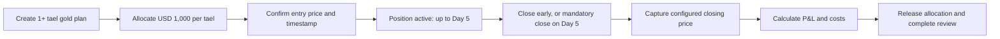

# TG Trading — Five-Day Gold Trade Cycle

## Confirmed initial rule

Each gold purchase has a **maximum holding window of five calendar days** from
its confirmed entry time. You may close it earlier whenever you decide to
realize profit or loss. Any position still open at the end of that window must
be closed, and TG Trading records its final profit or loss using the configured
gold price source and pricing rule.

This is a time-limited trade cycle, not a promise of profit. A position may end
with a gain, a loss, or a near-zero result after costs.

## Lifecycle

## Required transaction fields

| Field | Rule |
| --- | --- |
| Entry timestamp | Set when the purchase is confirmed |
| Mandatory-close timestamp | Entry timestamp plus 5 calendar days |
| Quantity | Whole/allowed increments of tael |
| Capital allocation | USD 1,000 × tael quantity, held until closure |
| Entry price | Recorded price and source at confirmation |
| Closing price | Price/source captured at expiry according to the agreed method |
| Costs | Spread, commission, financing/swap, and any approved fees, itemized |
| Realized P&L | Closing value minus entry value minus costs; never a fixed return |
| Outcome | Win, loss, or flat, based on realized P&L |

## Exact pricing rules to configure before use

The system must not calculate a result until these are decided and displayed to
you before confirmation:

1. **Gold reference:** exact instrument/grade (for example, the selected XAU/USD
   price feed or local physical-gold reference).
2. **Tael conversion:** physical weight represented by one tael, and how it maps
   to the reference price or broker contract.
3. **Entry side:** bid, ask, mid, or a named provider quote.
4. **Expiry closing side:** bid, ask, mid, or a named provider quote.
5. **Mandatory-close convention:** five calendar days at the same local-clock
   time as entry, in `Asia/Phnom_Penh`.
6. **Early-close convention:** you may submit an early close before that deadline;
   use the same transparent price rule and immediately realize P&L.
7. **Market-closed fallback:** if the reference market is closed at the mandatory
   close time, use
   the next available published quote and display that exception.

## User interface

### Before confirmation

Show: `1 tael`, `USD 1,000 allocated`, entry price/source/time, precise expiry
date/time, closing-price rule, all estimated costs, and a clear statement that
the final result depends on market price.

### Active position

Show: days and hours remaining, current indicative P&L (explicitly unrealized),
entry price, current reference price/source/timestamp, allocated deposit, and
the mandatory-close rule. Offer an explicit **Close and realize result** action.
Do not call the current result “won” or “lost” until closure.

### Expired position

Show: entry/closing prices, timestamps, itemized costs, realized P&L, released
allocation, outcome, and post-trade review.

## Risk controls

- The USD 1,000 allocation remains reserved while the trade is active and is
  released immediately after an early or mandatory close.
- Do not open a new purchase if the resulting allocation or maximum loss would
  breach your configured capital, daily-loss, weekly-loss, or drawdown limits.
- Flag a stale or unavailable price source at expiry; never silently substitute
  a price.
- Keep an immutable record of every price, source, computation, and manual
  override.

## Important implementation note

This five-day cycle describes the private product rule. If we later let other
people deposit funds or offer time-limited gold outcomes, obtain Cambodia-specific
legal and regulatory advice first; the commercial and regulatory treatment may
be very different from a personal trade journal or a standard broker position.
