# TG Trading — Local Gold Provider Workflow

## Product boundary

TG Trading is a private tool for managing local gold trades with providers whose
prices and terms are posted in Telegram groups. It records the deal, verifies
the provider quote you select, tracks the position for up to five days, and
calculates the outcome. It does not hold money, guarantee payment, or act as an
automatic execution venue.

## Provider registry

Each local gold provider has a private profile:

| Field | Purpose |
| --- | --- |
| Provider name / internal ID | Identify the dealer consistently |
| Telegram group/channel | Identify where information was received |
| Contact method | Your confirmed contact channel; do not expose it publicly |
| Gold product and tael unit | Prevent mixing different products or weights |
| Quote convention | Provider buy/sell meaning, currency, fees, and quote validity |
| Settlement terms | How the provider confirms purchase, early close, and mandatory Day-5 close |
| Trust status | Pending, verified by you, paused, or rejected |
| Notes | Your private history of responsiveness and completed deals |

Only a provider you have marked **verified by you** may be used in a new trade
plan. This is a personal operating rule, not a public certification.

## Local trade workflow

```mermaid
flowchart LR
    A[Provider posts local quote in Telegram] --> B[Record quote and source]
    B --> C[Select verified provider]
    C --> D[Create 1+ tael plan: USD 1,000 per tael]
    D --> E[Confirm terms directly with provider]
    E --> F[Record confirmed entry and five-day deadline]
    F --> G[Close early or no later than Day 5]
    G --> H[Confirm closing quote with same provider]
    H --> I[Record realized profit/loss and evidence]
```

## Deal-confirmation record

Before marking a gold trade active, TG Trading requires:

1. Selected provider and Telegram quote source.
2. Product/unit, tael quantity, and USD 1,000 allocation per tael.
3. Entry price, buy/sell side, all fees, and quote timestamp.
4. Direct provider confirmation reference: message link, screenshot, or a
   confirmation code you enter.
5. Exact mandatory-close timestamp: entry time plus five calendar days in
   `Asia/Phnom_Penh`.
6. Closing/early-exit method and the provider’s agreed price convention.

If any value is missing, save the item as a draft—not an active trade.

## Realizing a result within five days

- You can request/record an **early close** at any time before the deadline.
- The result is realized only after the provider confirms the closing price and
  the evidence is attached to the record.
- If no early close is recorded, the system sends reminders 24 hours and 2 hours
  before the deadline. At the deadline it marks the trade **requires close
  confirmation**; it must not invent a closing price.
- Once confirmed, calculate: closing value minus entry value minus every
  disclosed provider fee/cost. Release the USD 1,000-per-tael allocation.
- If there is a dispute or missing reply, label the trade **unresolved** and
  keep allocation reserved until you resolve it manually.

## UX screens

### Provider quotes

An ordered feed showing provider, gold product, quote side, price, tael unit,
message time, quote age, and `unverified` / `verified` state. Conflicting quotes
stay separate; do not average them.

### New local-gold trade

1. Select provider and supporting Telegram quote.
2. Enter quantity in tael; display `USD 1,000 × quantity` allocation.
3. Confirm entry terms directly with provider; attach proof.
4. Show the early-close action and exact mandatory Day-5 deadline.

### Active trade

Show provider name, entry terms, allocated capital, days/hours remaining, and
a clear **Record early close** action. Current provider messages are reference
information only until you confirm an actual closing quote.

### Completed/unresolved trade

Show both quote records, cost breakdown, realized result, and evidence. An
unresolved status is visually distinct from a win or loss.

## Safety rules

- Never treat an unverified Telegram post as a completed transaction.
- Keep payment and provider-confirmation evidence with the trade record.
- Do not store login credentials, payment PINs, or other people’s private group
  information.
- Do not transfer or custody anyone else’s funds in the private MVP.
- When the product is expanded to other users, provider verification, consumer
  disclosures, payment flow, licensing, AML/CFT, dispute handling, and data
  privacy must be redesigned and legally reviewed for Cambodia.
