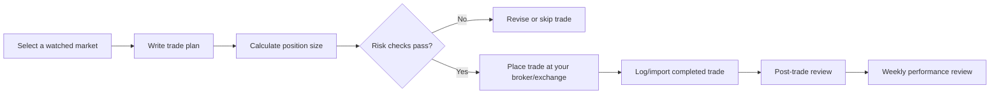

# TG Trading — Personal MVP

## Goal

Build a private trading workspace for one trader (you) to develop and validate
a repeatable process for FX, gold, and crypto. The product must optimize for
capital protection and decision quality, not promise daily or weekly profit.

## Success criteria

Before inviting any other user, use the system for at least 12 weeks and show:

1. Every trade has a documented setup, entry, stop loss, take profit, and risk amount.
2. No breach of the daily loss limit or maximum account drawdown rule.
3. A positive expectancy over a statistically meaningful sample for each strategy,
   after spreads, commissions, slippage, and financing costs.
4. Weekly reviews show that trades followed a written plan; profit alone is not
   sufficient evidence.
5. Deposits, withdrawals, and trading results reconcile to broker/exchange records.

## Scope: private first release

### Dashboard

- Account equity, daily P&L, weekly P&L, current drawdown, open risk, and remaining daily loss allowance.
- A clear **Demo** or **Live** label at all times.
- A small market watchlist for selected FX pairs, XAU/USD, BTC, and ETH.

### Trade plan and journal

- Create a setup checklist before entering: strategy, market thesis, entry,
  invalidation, stop loss, take profit, risk percentage, and optional chart image.
- Log actual entry/exit, costs, position size, and result automatically where
  supported, or manually with a broker statement import.
- Record a post-trade review: followed plan, emotion/discipline note, and lesson.

### Risk engine

- Risk per trade default: configurable, initially capped at 0.5–1% of equity.
- Daily loss limit: configurable; block new trade plans after it is reached.
- Weekly loss warning and maximum drawdown warning.
- Position-sizing calculator based on entry, stop loss, instrument value, and account equity.
- Exposure view: do not unintentionally stack highly correlated USD, gold, or crypto risk.

### Performance review

- Daily and weekly calendar view of P&L and risk used.
- Metrics by strategy and instrument: win rate, average win/loss, expectancy,
  profit factor, maximum drawdown, average holding time, and plan-adherence rate.
- Filter every result by Demo/Live, date range, strategy, and instrument.
- Require a short weekly review before beginning the next week.

### Alerts

- Price alert, planned entry-zone alert, and economic-event reminder.
- Risk alerts: missing stop loss, oversized position, daily-limit approach, and
  prolonged drawdown.
- Alerts are informational; no automated execution in the first release.

## Core workflow

## Architecture for the personal MVP

Start with a secure web app and mobile-responsive interface:

- **Frontend:** Next.js, Khmer/English-ready design tokens, responsive UI.
- **Backend:** a small TypeScript API with PostgreSQL.
- **Market data:** one licensed/read-only quote provider; label any delayed data.
- **Broker/exchange:** read-only import or API connection where available. No order
  placement or credential storage for execution in version one.
- **Security:** passkeys/MFA, encrypted secrets, encrypted backups, and activity log.

This intentionally avoids the operational and regulatory burden of holding user
money, executing orders, or onboarding other traders.

## Release sequence

1. **V0 — Manual journal:** dashboard, risk calculator, trade plan, manual trade log, weekly review.
2. **V1 — Data sync:** read-only broker/exchange imports, account reconciliation, chart snapshots, alerts.
3. **V2 — Decision support:** strategy comparison, correlation risk, backtest import, and personalized review prompts.
4. **Only after validation:** reassess whether a public product is appropriate;
   public access requires separate compliance, KYC/AML, custody, payments,
   support, incident response, and execution architecture.

## First decisions

1. Which broker(s) or exchange(s) will you use for FX/gold and crypto?
2. Which instruments and timeframes are in your initial trading plan?
3. What account currency, starting equity, maximum risk per trade, daily loss limit,
   and maximum drawdown limit do you want to use?
