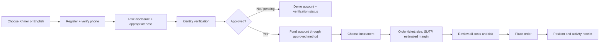
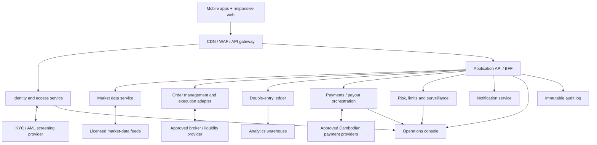

# TG Trading — Product, UX/UI, and Architecture Design

## 1. Product definition

TG Trading is a mobile-first trading platform for Cambodian retail traders to
view markets and trade FX, gold (XAU/USD), and crypto assets. It should feel
simple enough for a first-time trader while providing the risk controls and
market information expected by experienced users.

**Primary launch market:** Cambodia  
**Languages:** Khmer first, English second  
**Primary device:** Android, then iOS; responsive web for desktop research  
**Initial instruments:** major FX pairs, XAU/USD, BTC/USD, ETH/USD and a small,
curated set of liquid crypto pairs.

> Compliance gate: do not market, accept client funds, or enable live execution
> until Cambodian licensing, marketing, KYC/AML, sanctions screening, custody,
> and payment-provider obligations have been reviewed by qualified local counsel.

## 2. Users and product principles

| User | Need | Product response |
| --- | --- | --- |
| New retail trader | Confidence and plain-language guidance | Khmer onboarding, demo mode, clear risk explanation, simple order ticket |
| Active mobile trader | Fast market access and account visibility | Watchlists, one-tap trade from instrument page, live order/position status |
| Funded trader | Reliable deposits, withdrawals and audit trail | Local payment options only after approval, status timelines, receipts and identity controls |
| Support/operations team | Safe resolution of client issues | Account review queue, immutable activity logs, reconciliation and exception dashboards |

Design principles:

1. **Safety before conversion.** Demo trading, risk disclosures, appropriateness checks, and leverage defaults must precede the first live order.
2. **Khmer-native clarity.** Do not merely translate English finance jargon; use tested Khmer labels and examples.
3. **One trading decision per screen.** A trader should always know the instrument, price, position exposure, and the next irreversible action.
4. **Every balance has a source.** Deposits, withdrawals, fees, financing, P&L, and adjustments are traceable from the activity timeline.
5. **No implied guarantees.** Never use “safe profit,” promised returns, or social proof that makes trading look risk-free.

## 3. Feature design

### MVP — prove trust and core trading flow

| Area | Features |
| --- | --- |
| Account | Phone/email registration, MFA, Khmer/English selection, KYC identity and liveness flow, risk disclosures, demo/live account separation |
| Markets | Instrument search, watchlists, delayed/live quote entitlement, price chart, instrument specifications, market hours and trading-cost preview |
| Trading | Market and limit orders; stop loss/take profit; buy/sell quote; quantity/margin estimate; order review; open positions, pending orders and trade history |
| Portfolio | Equity, used/free margin, unrealized/realized P&L, exposure by asset class, balance activity and downloadable statements |
| Funding | Deposit/withdrawal requests through approved providers, payout-bank/wallet verification, transaction status, receipts, manual-review fallback |
| Trust & support | In-app help, ticket creation, outage/maintenance status, mandatory risk alerts, device/session management |
| Operations | KYC review, transaction reconciliation, customer/account lookup, manual holds, audit log, support tooling and basic risk monitoring |

### Later releases

- Price alerts and economic-calendar alerts
- Recurring investment / crypto spot conversion (only where permitted)
- Copy trading only after suitability, conflict-of-interest, and performance-disclosure design
- Education hub with Khmer video and glossary
- Advanced charts, trading journal, tax/export reports
- Referral program with compliance-approved messaging

### Explicitly out of MVP

- Binary options, “signal guarantees,” unmoderated copy trading, leveraged products without suitability controls, and self-custodied wallet support.

## 4. UX / UI information architecture

Bottom navigation (mobile):

1. **Home** — total account summary, market movers, learning/safety reminders
2. **Markets** — search, watchlists, FX / Gold / Crypto filters
3. **Trade** — focused order ticket for a selected instrument
4. **Portfolio** — positions, orders, transaction activity
5. **Profile** — verification, funding, security, support, settings

### Key flow: first live trade

### Core screens

| Screen | Purpose | Essential UI |
| --- | --- | --- |
| Home | Orient the user and surface account risk | Account mode badge (Demo/Live), equity, free margin, watchlist snapshot, risk warning |
| Markets | Help users find a tradable asset | Search, asset filters, bid/ask, daily move, favourite action, clear data-delay label |
| Instrument detail | Support a trade decision | Price/chart, spread, market hours, margin/leverage, buy/sell CTAs, position summary |
| Order ticket | Prevent input mistakes | Side selector, order type, size, stop loss/take profit, estimated margin/cost, confirmation step |
| Portfolio | Make exposure legible | Equity/margin strip, open positions, pending orders, P&L, activity ledger |
| Funding | Build confidence in money movement | Approved payment methods, fee/time estimate, status timeline, bank/wallet verification, support link |
| Verification | Set transparent expectations | Progress steps, accepted documents, privacy explanation, rejection reason and retry path |

### Interaction rules

- Always show the **account mode** (Demo or Live) and selected account currency.
- Show **Bid** and **Ask**, not a single ambiguous price.
- Before placing an order, show: direction, instrument, order type, quantity,
  estimated margin, spread/commission, financing notice, stop loss/take profit,
  and the maximum loss where calculable.
- Use a two-step action for live orders: `Review order` then `Confirm buy/sell`.
- Positions use text plus direction icons; red/green must never be the only P&L cue.
- Include Khmer/English text expansion in every layout, 44 px minimum touch targets,
  high-contrast mode, and numeric formatting that keeps USD and KHR unambiguous.

### Visual direction

- Calm, professional, and low-noise—not casino-like.
- Light and dark themes; neutral surfaces with one restrained brand accent.
- Use line/candlestick charts purposefully, with a readable default timeframe.
- Keep primary trading actions persistent only within context (instrument/order screens),
  never as a global “trade now” prompt.
- Localize all user-facing content, help text, errors, date formats, and legal disclosures.

## 5. System architecture

### Architectural boundaries

| Domain | Responsibility | Must be authoritative for |
| --- | --- | --- |
| Identity | Authentication, MFA, roles, devices, KYC state | Customer identity and access |
| Trading | Order validation, routing, fills, position state | Orders, executions, positions |
| Ledger | Append-only accounting entries and reconciliation | Cash balance and every monetary movement |
| Funding | Payment initiation, callbacks, payout controls | Deposit/withdrawal state—not balance itself |
| Market data | Quote normalization, entitlements, charts | Displayed pricing metadata |
| Risk/compliance | Leverage/size limits, exposure, AML/case flags | Trading/funding blocks and review cases |
| Notifications | Transactional alerts and delivery history | Message status, never core business state |

### Suggested implementation approach

- **Clients:** React Native (iOS/Android) plus Next.js responsive web; shared design tokens and translation catalogue.
- **Backend:** TypeScript services behind an API gateway; begin as a modular monolith with explicit domain modules, then extract high-load execution and market-data workloads if needed.
- **Data:** PostgreSQL for transactional records, Redis for ephemeral quote/session caching, object storage for encrypted KYC documents, and an analytical warehouse for reporting.
- **Integration:** Event bus/outbox pattern for fills, ledger postings, KYC updates, payment callbacks, and notifications. All external callbacks are signed, idempotent, and reconciled.
- **Observability:** Structured logs, traces, metrics, alerting, replayable event/audit history, and separate production access for operations.

## 6. Security, risk, and operational baseline

- MFA, device/session management, rate limits, secure credential storage, encryption in transit and at rest.
- Role-based access and four-eyes approval for withdrawals, manual balance adjustments, and high-risk account changes.
- An append-only double-entry ledger; never update a user’s cash balance solely from a payment-provider callback.
- Idempotency keys for trading and funding actions; show a definitive receipt or pending state after every submission.
- Pre-trade controls: instrument availability, account/KYC status, market hours, max size, leverage/margin, and fat-finger thresholds.
- Circuit breakers for stale quotes, execution-provider outages, unusual spreads, and payment reconciliation mismatches.
- Retention, consent, privacy, and data-residency rules must be decided with Cambodian legal/compliance counsel before production.

## 7. Delivery plan

1. **Discovery (2–3 weeks):** confirm target customers, legal model, execution partner, custody/funding model, localization research, and test the proposed flows with Cambodian users.
2. **Prototype (2 weeks):** clickable Khmer/English prototype for onboarding, instrument discovery, order ticket, portfolio, and funding request; validate comprehension and trust.
3. **MVP build (12–16 weeks):** demo mode first, then controlled live trading with instrument and account limits; operations console and reconciliation ship with the customer product.
4. **Pilot:** invite-only, monitored support, daily reconciliation, incident runbooks, and UX iteration before broad launch.

## 8. Decisions needed before UI implementation

1. Is TG Trading a licensed broker, an introducing broker, or a client experience on top of a regulated execution partner?
2. Which Cambodian payment rails and account currencies are approved for launch?
3. Will crypto be spot-only, CFD/derivative exposure, or excluded in the first regulated release?
4. Which user groups are eligible for live trading, and what are the initial leverage and instrument limits?
5. What is the legal entity, country of custody, and customer-support operating model?
