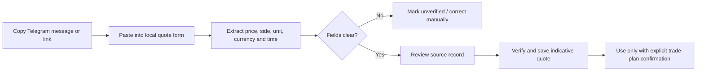

# TG Trading — Telegram-Sourced Local Gold Information

## Role of Telegram data

For the gold-first private MVP, Telegram groups provide local gold market
information: indicative buy/sell prices, dealer updates, local premiums, and
market commentary. Telegram messages are a **source record**, not automatically
authoritative settlement data.

Every planned and expired gold position must name the exact source message or a
manually verified quote used for its entry and closing price.

## Source policy

### Accepted source record

For each price update, store:

- Group/channel name and a stable internal source ID
- Message link or message ID, where available
- Original message timestamp and the time TG Trading received/recorded it
- Sender/dealer name as displayed in the group
- Raw message text or a permitted excerpt/screenshot
- Parsed gold product, buy price, sell price, currency, unit, and stated validity
- Whether it is **unverified**, **verified by you**, **superseded**, or **rejected**

### Price-use rules

1. A Telegram message is initially **unverified** and can appear in the market
   feed, but cannot settle a five-day result automatically.
2. You must explicitly select/verify the entry price before creating a gold plan.
3. At expiry, the system proposes the most recent eligible quote from the chosen
   source. You confirm it, or select a different verified source with a written
   reason.
4. Keep the original message and all overrides in the trade audit record.
5. Do not use messages with missing unit/currency, ambiguous side (buy/sell),
   stale timestamps, deleted context, or conflicting values without manual review.

## Private-MVP ingestion options

| Method | First-release suitability | Notes |
| --- | --- | --- |
| Manual paste | Best starting point | Copy a message/link into TG Trading; confirm parsed price and unit |
| Screenshot upload | Useful fallback | Preserve evidence; require manual price extraction/confirmation |
| Forward to a private bot | Later, if group rules allow | Bot records only messages voluntarily forwarded to it |
| Direct group integration | Later, with written group/admin permission | Requires Telegram API design, access controls, and robust message-change handling |

Start with manual paste and screenshots. Do not scrape private groups or collect
member data without clear permission from the group administrator and affected
participants.

## UX flow: record a local quote

## Gold dashboard changes

- Show a chronological **Local Telegram quotes** feed, clearly marked
  `Indicative` or `Verified`.
- Display source name, message time, price side, unit, currency, and age of quote.
- Never collapse mixed products/units into one “gold price.”
- Highlight conflicting quotes rather than averaging them.
- Let you select one verified source as the reference for each five-day trade;
  subsequent updates from other groups remain context only.

## Required configuration before we build the parser

1. The Telegram groups/channels you are permitted to use.
2. Example price messages with sensitive names/numbers redacted if necessary.
3. The local gold products and units used in those messages.
4. Whether a posted figure means dealer **buy**, dealer **sell**, or a mid/reference price.
5. The rule for selecting an expiry quote when the chosen group has no timely update.

## Security and privacy

- Store only the minimum source content necessary to explain a price decision.
- Keep groups private by default; access is limited to you in the personal MVP.
- Do not republish dealer quotes, member names, phone numbers, or message content
  to other users without permission.
- Treat Telegram content as potentially manipulated; require verification and
  preserve the audit trail for every decision.
