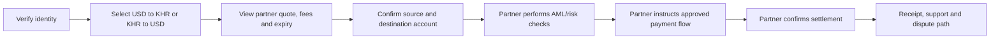
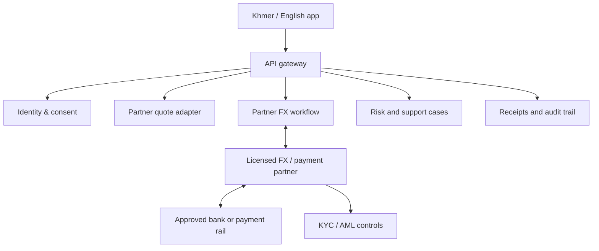

# TG Trading — Future USD/KHR P2P Exchange Concept

## Status

This is a **future phase**, not part of the personal gold MVP. It must not be
built as a live marketplace, take custody, hold client balances, quote binding
rates, or match money transfers until Cambodian legal counsel and the National
Bank of Cambodia (NBC), where appropriate, confirm the permitted operating model.

## Why it is a separate product

USD/KHR local exchange is a consumer payments and foreign-exchange product, not
a leveraged trading product. Its user experience, fraud risk, disputes, payment
controls, accounting, and licensing requirements are fundamentally different
from the private XAU/USD trade journal.

NBC’s published foreign-exchange regulations state that people conducting foreign
exchange dealings need prior authorization, and define money-changer operations
as buying/selling domestic and foreign currency. The exact treatment of an
online P2P marketplace, agency, escrow, and payment flow needs Cambodia-specific
legal advice before any product decision. See the NBC’s [money changer licence
or authorization Prakas](https://www.nbc.gov.kh/download_files/legislation/banking_code_2011.pdf)
and [foreign-exchange dealer management Prakas](https://web.nbc.gov.kh/download_files/legislation/prakas_eng/3.pdf).

## Safer product options to evaluate

| Model | What TG Trading does | Regulatory/commercial dependency |
| --- | --- | --- |
| Licensed-partner directory | Shows approved money changers and their public rates; users transact directly with the partner | Partner permissions, rate accuracy and disclosures |
| White-label licensed exchange | Provides the interface while an NBC-authorized partner performs onboarding, quotation, FX conversion, settlement and records | Formal contracts, approved system/data flows, partner controls |
| Licensed operator | TG Trading itself offers conversion | NBC licensing/authorization, capital, AML/CFT, reconciliation, safeguarding and full operating capability |
| User-to-user marketplace | Lists/matches verified users, with no TG Trading custody | Written legal confirmation is essential; matching, fees, rate setting, escrow, and payment facilitation may change the regulatory analysis |

Do not begin with an unlicensed escrow or wallet. It creates the greatest fraud,
reconciliation, consumer-protection, and regulatory risk.

## Recommended first validation: non-transactional rate board

After the gold MVP is stable, start with a private **USD/KHR rate and demand
journal** rather than P2P execution:

- Record indicative buy/sell rates from authorised sources and the NBC official
  reference rate; clearly label their purpose and timestamp.
- Track your own exchange needs, preferred payment methods, and manual outcomes.
- Do not take deposits, store another person’s bank credentials, publish binding
  offers, or instruct users to send money to each other.
- Use this evidence to determine whether there is a genuine problem worth solving.

Cambodia is highly dollarized and NBC describes USD and KHR as the two primary
currencies in local payment instruments. Bakong supports peer-to-peer fund
transfers through participating banks/financial institutions, but it is a
payment rail—not itself permission to operate an FX marketplace. See NBC’s
[payment-instruments overview](https://www.nbc.gov.kh/english/payment_systems/overview_of_payments_instruments.php)
and [Bakong overview](https://bakong.nbc.gov.kh/en/).

## If a compliant partner-backed marketplace is approved

### Consumer flow

### Required controls

- Partner-owned KYC/AML/sanctions screening, transaction monitoring, and
  suspicious-activity escalation.
- Name/account verification and limits before payment instructions are shown.
- Quotes with rate, fee, receiving amount, expiry, cancellation/refund rules,
  and an immutable receipt.
- No user-visible “profit” claims; disclose exchange-rate spread and all fees.
- Payment-state reconciliation with idempotent callbacks. Never mark a transfer
  settled solely because a user uploads a screenshot.
- A staffed dispute process, fraud-report path, audit log, and access controls.

## Architecture boundary for a future compliant service

TG Trading should not operate a user wallet or internal float unless the approved
legal and licensing model explicitly allows it. The partner remains authoritative
for customer funds, FX conversion, settlement, and compliance decisions.

## Entry gates

1. Complete and independently review 12 weeks of personal gold-trading data.
2. Obtain a written Cambodian legal opinion on the exact intended USD/KHR model.
3. Select an NBC-authorized FX/payment partner, or obtain the necessary authorization.
4. Document AML/CFT, safeguarding, privacy, complaints, fraud, reconciliation,
   and incident-response controls.
5. Run a closed pilot with manual partner settlement and daily reconciliation
   before opening anything to the public.
